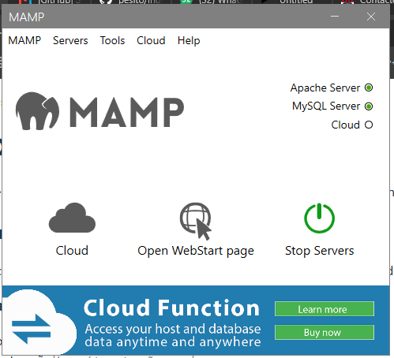
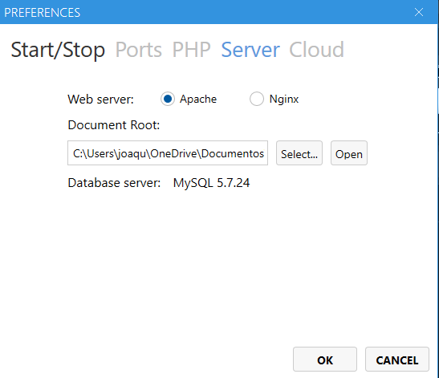
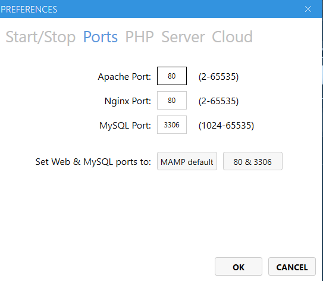
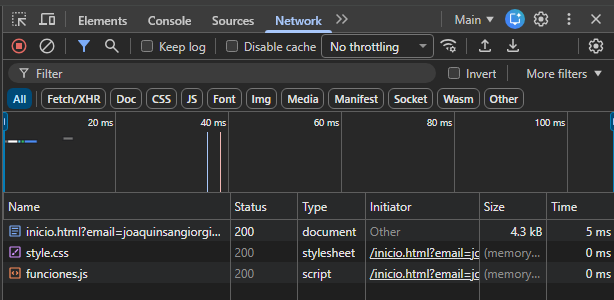

# Pesito

## Sección I: Planificación y Análisis Funcional

### 1. Propósito y Propuesta de Valor

Mi idea para este proyecto, se basa en algo personal, quería que el proyecto de cursada me deje tanto un desafio técnico, como un "producto" de valor que pueda utilizar en mi día a día. 

Por lo tanto, me puse a pensar en algo que quisiera solucionar en mi vida que otras aplicaciones o tecnologías no lo hacen o bien, no son gratis o no me gustan del todo. También me sucedia que las aplicaciones que están buenas para solucionar algo, tienen miles de anuncios, funcionalidades pagas, etc.

Por lo tanto, elegí ir por el problema que tengo que a fin de més no se en que gasté la plata, en donde, en que momento y que podria hacer para identificarlo o solucionarlo. Intenté varias veces con un excel, llevar el registro por Whatsapp o anotarlo en papel, pero siempre termino dejandolo porque es dificil de acceder, no lo tengo a mano en el momento que realizo el gasto, me tengo que esforzar mucho para luego analizar todo y tomar decisiones, etc.

Es por eso, que decido crear "Pesito", para que todo usuario que quiera usarlo, tenga un lugar centralizado y sobre todo simple para registrar sus ingresos, gastos y metas de ahorro. 

#### ¿Qué diferencia a Pesito del resto de plataformas similares?

Pesito está diseñado para personas que necesitan claridad, simpleza y utilidad. El resto de plataformas, esta abarrotada de funcionalidades, son difíciles de entender o utilizar o son pagas. 

Con Pesito vas a tener una interfaz sencilla, sin vueltas y con lo necesario para que lleves un registro de tus gastos, ahorros e ingresos. 

### 2. Objetivos del Sistema

**Objetivo general:**
Brindar una plataforma web simple que permita a una persona registrar y visualizar su actividad financiera personal (ingresos, gastos y metas de ahorro) de forma rápida y clara.

**Objetivos específicos:**

1. Permitir el registro estructurado de movimientos financieros (monto, categoría, fecha y tipo).
2. Permitir la definición de una meta de ahorro y el seguimiento visual de su progreso.
3. Generar un informe visual simple que compare ingresos y gastos a lo largo del tiempo.
4. Garantizar que la interfaz sea utilizable tanto en computadoras de escritorio como en dispositivos móviles.

### 3. Público Objetivo (User Personas)

**Persona 1 — "Brenda, 23 años, trabajadora en relación de dependencia"**
Recibe su sueldo mensual y algunos ingresos extra ocasionales de sus emprendimientos. Quiere entender en qué se le va la plata a fin de mes y ahorrar para un viaje. Usa el celular la mayor parte del tiempo → **prioriza una navegación mobile fluida y carga rápida de datos**.

**Persona 2 — "Joaquín, 23 años, estudiante y trabajador independiente"**
Tiene ingresos variables (changas, proyectos freelance) y gastos irregulares. Necesita una forma rápida de anotar movimientos sueltos sin fricción, generalmente desde la notebook. Quiere comprarse una notebook pero le cuesta darse cuenta cuanto dinero ahorrado tiene o cuanto podría ahorrar. → **prioriza formularios cortos, rápidos de completar, con validación clara de errores**.

**Persona 3 — "Roberto, 55 años, usuario con poca familiaridad tecnológica"**
Quiere empezar a controlar sus gastos pero se frustra con aplicaciones complejas. → **prioriza una interfaz simple, textos claros, botones grandes y mensajes de error entendibles (no técnicos)**.

Estos tres perfiles influyen directamente en decisiones de usabilidad: formularios cortos con validación visual inmediata, textos en lenguaje simple, accesos directos a las cuatro acciones principales desde el home, y diseño mobile-first que se resuelve en la Fase 2.

### 4. Alcance Funcional de las Páginas

| Página | Contenido y funcionalidad |
|---|---|
| **`index.html`** | Punto de entrada obligatorio del sitio. Muestra la propuesta de valor (slogan) y, debajo, dos formularios: iniciar sesión y crear cuenta (acceso simulado del lado del cliente, sin backend real). Al enviarlos, el usuario pasa a `inicio.html`. |
| **`inicio.html`** | Home del usuario logueado. Repite la propuesta de valor y ofrece cuatro accesos rápidos bien visibles: cargar un gasto, cargar un ingreso, ver ahorros y ver reportes. Incluye un resumen del mes (saldo, ingresos y gastos). |
| **`gastos.html`** | Formulario para cargar un gasto (descripción, monto, categoría, fecha), total gastado en el mes e historial de gastos con buscador. |
| **`ingresos.html`** | Formulario para cargar un ingreso (descripción, monto, categoría, fecha), total ingresado en el mes e historial de ingresos con buscador. |
| **`ahorros.html`** | Meta de ahorro actual con su barra de progreso y formulario para definir una nueva meta. |
| **`reportes.html`** | Informe visual que compara ingresos y gastos por mes, gastos agrupados por categoría y un formulario de contacto/soporte. |

**Flujo de navegación:** `index.html` (slogan + login/registro) → `inicio.html` (home con accesos rápidos) → `gastos.html` / `ingresos.html` / `ahorros.html` / `reportes.html`. Todas las páginas internas comparten el mismo menú de navegación, con un enlace para cerrar sesión que vuelve a `index.html`.

### 5. Justificación Tecnológica

El proyecto respeta la separación de responsabilidades del desarrollo web del lado del cliente:

- **HTML (estructura):** define el contenido y la semántica de cada página — qué es un encabezado, qué es un formulario, qué es una tabla de datos — independientemente de cómo se ve o se comporta.
- **CSS (presentación):** centralizado en `recursos/style.css`, es el único responsable de la apariencia visual (colores, tipografía, distribución en pantalla, adaptabilidad a distintos tamaños de pantalla). El HTML no contiene atributos de presentación (`style=""`, `<font>`, etc.).
- **JavaScript (comportamiento):** centralizado en `recursos/funciones.js`, es el único responsable de la lógica de interacción (validaciones en tiempo real, menú móvil, cálculo de metas, renderizado dinámico del historial e informes). El HTML no contiene manejadores de eventos inline (`onclick`, `onsubmit`).

Esta separación permite que cada archivo pueda modificarse de forma independiente sin romper a los otros dos, y es exactamente el criterio que se aplica fase a fase: la Fase 1 entrega solo estructura, la Fase 2 agrega estilo, y la Fase 3 agrega comportamiento.

> **Nota sobre el login:** dado que esta materia cubre exclusivamente tecnologías del lado del cliente (no hay servidor de aplicación ni base de datos), el "login" de `index.html` es una simulación: valida el formulario y persiste los datos localmente en el navegador (`localStorage`), pero no constituye un mecanismo de autenticación real. Esta distinción se explicita para la defensa oral. Mi idea es luego si el proyecto escala, hacer todo un backend de esto, con posibilidad de alojar usuarios y datos de usuarios en una base de datos y que tenga aplicación movil.

---

## Sección II: Arquitectura Técnica de Servidores

### Diagrama de Arquitectura Cliente-Servidor

```
   ┌──────────────────────┐                                   ┌───────────────────────────┐
   │        CLIENTE        │                                   │      SERVIDOR (Apache)      │
   │    (Navegador Web)     │                                   │         vía MAMP             │
   │                         │                                   │                               │
   │  HTML + CSS + JS        │──────  Petición HTTP (GET)  ─────▶│  Localiza el recurso en el    │
   │  (index/inicio/gastos/  │        http://localhost/...       │  árbol de directorios         │
   │   ingresos... .html)    │                                   │  (Document Root: pesito/)     │
   │                         │◀─────  Respuesta HTTP (200 OK)  ──│                               │
   │  Renderiza el DOM y      │        + archivo solicitado       │  Devuelve el archivo tal cual  │
   │  ejecuta funciones.js    │        (.html / .css / .js /      │  (sitio estático, sin lógica   │
   │                         │         imágenes)                 │  de servidor ni base de datos) │
   └──────────────────────┘                                   └───────────────────────────┘
```

**Ciclo de petición y respuesta:**

1. El usuario ingresa `http://localhost/` en el navegador (cliente). Como la petición apunta a la raíz, Apache responde con `index.html` gracias a la directiva `DirectoryIndex`.
2. El navegador envía una **petición HTTP GET** al servidor Apache local (levantado por MAMP), solicitando ese recurso.
3. Apache localiza el archivo en el árbol de directorios del proyecto y responde con un código de estado **200 OK** junto con el contenido del archivo (HTML).
4. El navegador parsea el HTML, y por cada recurso enlazado (`style.css`, `funciones.js`, imágenes) repite el ciclo: nueva petición GET → nueva respuesta del servidor.
5. Una vez recibidos todos los recursos, el navegador construye el DOM, aplica los estilos y ejecuta el JavaScript. Toda la lógica de interacción posterior (validaciones, cálculos, `localStorage`) ocurre **enteramente del lado del cliente**, sin nuevas peticiones al servidor.

Al ser un sitio estático, el servidor Apache actúa únicamente como distribuidor de archivos (no hay procesamiento server-side, ni base de datos, ni sesiones de servidor).

### Configuración del servidor local (MAMP)

1. **Servidores iniciados:** Apache corriendo desde el panel de MAMP.

   

2. **Document Root:** Apache apunta directamente a la carpeta del proyecto, por lo que el sitio se sirve en la raíz `http://localhost/` (sin copiar archivos a `htdocs`).

   

3. **Puerto 80:** es el puerto estándar de HTTP, por eso la URL no necesita indicar puerto (`http://localhost/` en lugar de `http://localhost:8888/`).

   

4. **Ciclo petición / respuesta en acción:** en la pestaña *Network* de las herramientas del navegador se ve cómo, al cargar una página desde `localhost`, el navegador pide primero el documento HTML y después cada recurso enlazado (`style.css`, `funciones.js`), y el servidor responde a cada uno con el código de estado **200 OK**.

   

### Árbol de Directorios

```
pesito/
├── index.html                  (Punto de entrada obligatorio del sitio)
├── inicio.html                  (Home del usuario — accesos rápidos)
├── gastos.html                  (Carga de gastos + historial)
├── ingresos.html                (Carga de ingresos + historial)
├── ahorros.html                 (Meta de ahorro y progreso)
├── reportes.html                (Informes y contacto)
├── recursos/
│   ├── style.css                   (Hoja de estilos CSS externa unificada)
│   ├── funciones.js                  (Script lógico de comportamiento JavaScript)
│   └── imagenes/                       (Archivos multimedia, iconos y capturas)
├── planificacion/
│   └── PLANIFICACION.md                 (Este documento)
├── ENLACES.txt                  (Links al sitio publicado, wireframes y repositorio)
└── README.md
```


---

## Sección III: Diseño Visual Conceptual (Bocetos)

Los wireframes de todas las vistas están en Figma, cada una en versión **escritorio (1440 px)** y **móvil (390 px)**:

**https://www.figma.com/design/BIAIYR00IH8I3REvZRtIuV**

| Vista | Reorganización en móvil |
|---|---|
| 01 · Index (login / registro) | Los formularios de inicio de sesión y registro pasan de estar lado a lado a apilarse. |
| 02 · Inicio (home) | Los cuatro accesos rápidos pasan de una fila a una grilla de 2×2; el resumen del mes se apila. |
| 03 · Gastos / 04 · Ingresos | El total del mes sube arriba del formulario y la tabla del historial se convierte en una lista. |
| 05 · Ahorros | El consejo sobre metas baja al final de la página. |
| 06 · Reportes | Los gráficos y el formulario de contacto se apilan. |

En escritorio el menú de navegación se muestra completo en el header; en móvil se reemplaza por un botón de menú (hamburguesa).
